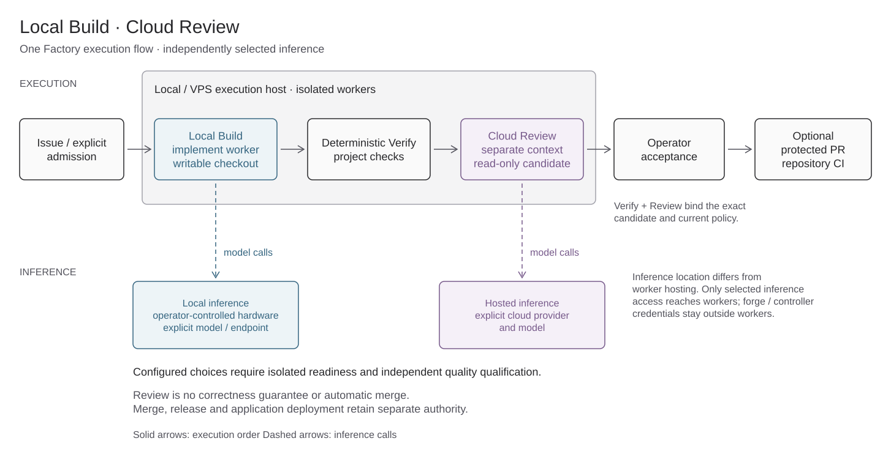

# Architecture

The package has two independently useful parts: a portable method and a local runtime. An application can adopt the method with its existing agent and CI without running this controller.

## Migration contract

The target product is Factory Foundation, the portable `adlc/` method and
skills, the current Inbox UI, and minimal native-harness integration. GitHub
owns issues, PRs and CI. Native Codex owns its sessions, execution, context,
permissions and supported schedules. Retain a small npm/npx setup, discovery
and dashboard launcher. The first opt-in Codex setup and Inbox slice is
[implemented in source](native-codex.md), pending live host qualification.

Codex comes first; Claude follows. Pi/local tuning and other providers are
deferred. Do not add a Factory scheduler or custom context/retry engine. Keep
independent review, real checks, exact-candidate binding, least privilege and
private historical evidence. Retire old runtime pieces only after replacements
are proven. Preserve the accepted Inbox design and its assets/layout. CLI
sessions are not guaranteed to appear in the desktop app; that remains a future
qualification gate.

The integration backend connects the Inbox to repository APIs and the selected
harness, authenticates those calls, and correlates issue/session and candidate
references. Native harnesses own execution and recovery. Codex is tracked in
[#114](https://github.com/arcitai/software-and-defence-factory/issues/114);
Claude Code, Cursor and Grok are separate later qualification tracks.

Each project selects its own harness configuration, history, skills, plugins and
connection identities. Unattended execution and tool access are separate choices:
no recurring approval prompts inside the agreed authority, and no inherited
personal connections. Verify effective settings and the actual tool inventory,
including negative tests for personal and cross-project access. If an upstream
connection cannot use the project's intended identity, leave it unavailable.
A dedicated unprivileged OS user is recommended. An explicitly chosen existing
user is supported with its limits recorded: a separate configuration home is not
OS isolation, especially with full host access or sudo. This integration is not
yet qualified.

The small CLI retains setup and maintenance responsibilities. An opt-in native
OS update service may check Factory releases, then activate a verified version
only when idle, with health checks and rollback. Preserve project settings,
credentials and history; harness updates remain owned by each harness. This
maintenance route is follow-up work, not an installed service in this slice.

The remaining sections documents the currently shipped controller and
its boundaries. It is a description of the installed implementation, separate
from the migration target above.

## Setup and deployment

[Editable setup view](diagrams/deployment.excalidraw). Factory Foundation guides
explicit preparation of the repository, CI and execution host. The operator uses
the CLI or loopback dashboard locally or through an SSH tunnel. The host supplies
Docker, the selected harness and a separately configured local or cloud inference
endpoint. Application production deployment stays in its own CI/CD.

## Runtime layers and ownership

[Editable runtime view](diagrams/architecture.excalidraw). Dashboard and CLI share
one controller API. The controller owns the queue, checks, retained source,
artifacts and provider write receipts. Isolated jobs receive the retained checkout,
selected harness and runtime skills. Foundation is packaged operator guidance
outside job execution. Jobs receive only selected inference credentials;
repository/provider credentials stay with the controller, while CI, authorized
merge and application deployment retain their separate authority. Neither source
instructions nor skills can grant that authority.

Role harness/model overrides and opt-in private local bindings are implemented
through the shared [definition contract](definition.md). Broader per-role
skills/resources/access restrictions, additional repository providers, MCP,
scores/benchmarks and reviewed self-improvement remain planned. The repository
Inbox and its explicit admission lifecycle are delivered (#60), with the shared
list/board work view in 0.12.0.

## Work lifecycle

[Editable lifecycle view](diagrams/lifecycle.excalidraw). An issue or local brief
enters execution only through explicit Start, which retains the source revision.
Implementation proceeds through project checks and independent review before
operator acceptance and patch handoff. Requested changes create a new attempt
with fresh checks and review. Optional PR publication, repository CI, authorized
merge and deployment are separate steps. Defence instead produces private scoped
investigation evidence; production recovery requires separate authority.

## Local Build · Cloud Review

[Editable hybrid view](diagrams/hybrid.excalidraw) ·
[Selectable recipe and qualification](hybrid.md). Issue / explicit admission →
Local Build → deterministic Verify → Cloud Review → operator acceptance →
optional protected PR and repository CI. The implementation worker calls an
explicit local model; an independent read-only review context calls an explicitly
selected hosted model. Both isolated workers may share a local or VPS execution
host: inference location does not determine worker hosting.

Build keeps the `implement` key and returns to Factory's checks and separate
Review. The recipe adds no scheduler or roles; Audit remains scoped Defence work.
Checks and Review bind the exact candidate and current policy. Configured
profiles are not qualified quality; Review grants neither correctness nor merge
authority. Merge, release and application deployment remain separately authorized.

## Shipped runtime

`factory/queue.mjs` owns state transitions and persists every attempt before execution. At admission, `source-admission.mjs` resolves the configured or explicit ref and retains its commit objects in a private per-job bare repository. The protected job record binds that repository identity, requested ref and resolved SHA; retries and revisions restore from those retained objects. `server.mjs` adapts the queue and private artifacts to the dashboard. `processes.mjs` owns process groups, deadlines and reconciliation. `executor.mjs` creates the checkout, runs roles through the selected harness and application checks, records review and validates handoff.

Software phases are build → verify → review → approved handoff. An implementation receives a writable job checkout; verification and review cannot modify that candidate. Both must cover the candidate commit and current policy hash. A requested revision preserves old work and starts a fresh implementation/check/review sequence. Retry resumes a stopped phase only after process/container reconciliation.

Trusted PR delivery is a separate, opt-in controller action after acceptance.
The private operator configuration selects the GitHub repository and `main` or
`dev` target; admission separately records the source ref and canonical source
repository identity. The controller reconstructs the approved tree from its
retained base and protected patch, records intent before writes, and stores the
branch/PR/readback receipt in the same job record. GitHub credentials stay on
the controller. Workers do not receive them. A PR receipt is delivery only;
PR checks, integration, merge, release and deployment remain distinct.

Defence is a separate read-only investigation workflow over admitted incident evidence. Both workflows use one execution owner; no competing scheduler exists. Schedules belong to the selected harness; Factory has no cron module or issue watcher. Live production connectors, arbitrary workflow editing and autonomous deployment are not implemented.

`dashboard/` preserves the selected task board, details, files, history, analytics, infrastructure, agents, skills and definition views. Vite builds self-contained assets into `factory/ui/`; npm consumers need no frontend toolchain. The UI displays actual queue records, with unreported cost/tokens remaining unknown.

## Repository integration

The [provider boundary](integrations.md) selects supported issue capabilities from
the Git origin. GitHub is the first adapter; unknown hosts retain local execution.
The CLI and dashboard call one controller API. Remote issues remain with their
provider; SQLite stores execution records and durable write receipts for recovery,
not a second issue backlog. Creating a remote issue never schedules execution.
The harness owns optional automations and calls the same API/CLI.

## Method and updates

`adlc/skills/` is the single canonical catalog for triage, specification,
implementation, review, security and evaluation. Jobs receive it read-only at
`/factory-skills`, alongside `adlc/` at `/factory-policy`. Codex agent phases
mount the same catalog at `/etc/codex/skills` for native discovery; Pi retains
`--skill /factory-skills`. Custom harnesses receive the prompt-facing contract
and require separate discovery qualification. All six remain available; there
is no per-role restriction or new model/browser capability.

`AGENTS.md` and `.agents/skills/` belong to repository contributors and explicit
operator adoption. Factory Foundation lives at
`.agents/skills/factory-foundation/SKILL.md`, is independent of AIOS, and is
available via `factory foundation` from an installed npm package. It is never
mounted as job policy. An adopting repository may contain operator guidance;
its presence in `/workspace` is readable, untrusted project context and cannot
grant host authority, credentials or broader permissions.

The export command maps `adlc/skills/` to staged `.agents/skills/` for deliberate
method adoption. It refuses existing destinations, never edits an application's
AGENTS.md and never installs global skills. CLI/API/dashboard read installed
skill paths, content and SHA-256 from the same definition.

The npm CLI keeps runtime state outside node_modules. The updater installs immutable releases, validates package identity and activates only while registered controllers and executors are stopped. Container images stay pinned to their installed image IDs until an explicit reinstall. See [update behavior](npm.md).

## Sources of truth

| Fact | Owner | Consumers |
| --- | --- | --- |
| Vocabulary | `factory/terminology.json` | Definition catalog, dashboard, CLI |
| Agent roles, skills and phase order | `factory/definition.mjs` | Queue, definitions API, CLI and UI |
| Instance settings | Private `factory.json` | Controller and immutable admitted attempt config |
| Job state, attempts and external write receipts | Private SQLite queue | CLI/API and dashboard |
| Admission-time repository identity, requested ref and commit | Protected job record plus per-job retained Git objects | Queue, executor, retry/revision, status and evidence |
| Trusted delivery target and durable PR receipt | Private operator configuration and protected SQLite job record | Controller delivery adapter, CLI/API and dashboard |
| Remote issue metadata | Selected provider (GitHub adapter first) | Live adapter reads, CLI/API and dashboard |
| Automation schedule | Selected harness | Explicit calls into Factory CLI/API |
| List/board status groups | `dashboard/src/runs-board.js` | Both task views and their filters |
| Host details | `factory/machine.mjs` | Infrastructure API and dashboard |
| Job instructions | `adlc/skills/`, `adlc/policy.md` | Read-only execution mounts and staged method export |
| Setup guidance | `.agents/skills/factory-foundation/`, `docs/setup.md` | Explicit operator CLI/Skills view |
| Native issue/thread identity | Private JSON receipt plus Codex history | Native Inbox; Codex remains the session source of truth |

`workflows.mjs` is a compatibility re-export, not another definition. Stored
identifiers and compatibility API fields are documented in [concepts](concepts.md).
Planned features belong in issues, not dormant engines.
